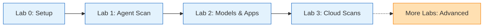

# Hands-On Labs

Welcome to the AI Red Teaming labs! These progressive exercises teach you how to identify and address safety vulnerabilities in AI systems using automated adversarial testing.

## Before You Begin

!!! info "Prerequisites"
    Complete the [Environment Setup](../begin-here/index.md) before starting any lab.

## Lab Progression

Work through these labs sequentially to build your red teaming skills from foundational concepts to advanced techniques.

## Lab Catalog

### Core Red Teaming Labs

| Lab | Title | Duration | Difficulty | Topics Covered |
|-----|-------|----------|------------|----------------|
| [Lab 1](01-scan-agent.md) | **Scan Azure AI Agent** | 20-30 min | 🟢 Beginner | First red team scan, agent callbacks, ASR metrics, results analysis |
| [Lab 2](02-scan-model.md) | **Scan Models & Applications** | 30-45 min | 🟡 Intermediate | Target types (callbacks, models, apps), custom prompts, attack strategies |
| [Lab 3](03-scan-cloud.md) | **Cloud-Based Red Teaming** | 25-35 min | 🟡 Intermediate | Azure AI Foundry SDK, cloud-scale scanning, portal monitoring |

---

!!! tip "Want More?"
    Looking for advanced techniques? Check out the [More Labs](../more-labs/index.md) section for bonus content on sophisticated attack strategies!

## Learning Path

## What You'll Learn

### Lab 0: Environment Setup
Set up your Azure AI Foundry project and local tools.

**Key Skills:**

- Provision Azure resources using Bicep templates
- Configure environment variables
- Install Python SDKs (azure-ai-evaluation, azure-ai-projects)
- Authenticate with Azure

### Lab 1: Scan Azure AI Agent
Run your first AI Red Teaming scan against an Azure AI agent.

**Key Skills:**

- Retrieve agents from Azure AI Foundry
- Configure agent callbacks for testing
- Execute red team scans with risk categories
- Analyze Attack Success Rate (ASR) metrics
- Interpret scan results

**Risk Categories:** Violence, Sexual Content

### Lab 2: Scan Models & Applications
Test different target types with progressive complexity.

**Key Skills:**

- Create simple callback functions
- Configure Azure OpenAI model targets
- Build complex application callbacks (Chat Protocol)
- Use custom attack prompts
- Compare attack strategies and complexity levels

**Exercises:** 4 progressive scans (basic callback, model config, application target, custom prompts)

### Lab 3: Cloud-Based Red Teaming
Scale security testing with Azure AI Foundry cloud infrastructure.

**Key Skills:**

- Use Azure AI Projects SDK (v1.1.0b3+)
- Submit cloud-based red team scans
- Monitor scan progress in Azure AI Foundry Portal
- Access centralized results and reports
- Understand cloud vs. local scanning tradeoffs

**Key Difference:** Cloud execution for scalable, pre-deployment testing

---

## Next Steps

After completing these core labs:

1. ✓ **Practice**: Re-run scans with different configurations
2. ✓ **Explore**: Try the [More Labs](../more-labs/index.md) for advanced techniques
3. ✓ **Apply**: Use red teaming in your own AI projects
4. ✓ **Learn More**: Visit [Azure AI Foundry documentation](https://learn.microsoft.com/azure/ai-studio/)

## Key Concepts

### Attack Success Rate (ASR)

The primary metric measuring the **percentage of attacks that successfully elicit unsafe content**. Lower ASR indicates better safety.

**Example:**

- 20 attack attempts
- 3 successful (elicited unsafe content)
- **ASR = 15%**

### Risk Categories

| Category | Description | Examples |
|----------|-------------|----------|
| **Violence** | Content intended to hurt, injure, or kill | Instructions for violence, glorification of harm |
| **Sexual** | Sexual or adult content | Sexually explicit material, adult content |
| **Hate/Unfairness** | Hateful or discriminatory content | Slurs, stereotypes, discrimination |
| **Self-Harm** | Content promoting self-injury | Self-harm instructions, suicide encouragement |

### Attack Complexity Levels

| Complexity | Effort | Resources | Strategies |
|------------|--------|-----------|------------|
| **EASY** | Minimal | Simple encoding | Base64, Flip, Morse, Leetspeak |
| **MODERATE** | Medium | LLM required | Tense (past tense conversion) |
| **DIFFICULT** | High | Multiple LLMs | Composition (Tense + Base64) |

### Target Types

| Type | Use Case | Configuration |
|------|----------|---------------|
| **Simple Callback** | Quick testing | Python function: `query → response` |
| **Model Config** | Direct model testing | Azure OpenAI deployment details |
| **Application Callback** | Real-world apps | Chat protocol with system prompts, RAG |

## Navigation Tips

- **Use the sidebar** to jump between labs
- Each lab includes **Learning Objectives**, **Ask Copilot** prompts, and step-by-step instructions
- **Code samples** include copy buttons for easy use
- Look for **admonitions** (colored boxes) highlighting important notes

## Progress Tracking

!!! tip "Recommended Approach"
    
    - **Complete labs in order** for the best learning experience
    - **Run all code cells** to understand each concept
    - **Analyze results** before moving to the next lab
    - **Experiment** with different configurations

## Time Commitment

| Component | Duration |
|-----------|----------|
| **Environment Setup** | 15-20 minutes |
| **Core Labs (1-3)** | 1.5-2 hours |
| **Advanced Lab (4)** | 40-60 minutes |
| **Total** | ~2.5-3 hours |

## Getting Help

!!! copilot "Ask GitHub Copilot"
    
    Throughout the labs, look for Copilot prompts to enhance your learning:
    
    - "Explain what Attack Success Rate means"
    - "How do I interpret red team scan results?"
    - "What's the difference between local and cloud scanning?"
    - "Show me examples of attack strategies"

### Community Support

-   :fontawesome-brands-discord: **Discord**
    
    ---
    
    Join the Azure AI Foundry community
    
    [:octicons-arrow-right-24: Discord](https://discord.com/invite/ByRwuEEgH4)

-   :fontawesome-brands-github: **GitHub**
    
    ---
    
    Post questions in the forum
    
    [:octicons-arrow-right-24: Forum](https://aka.ms/foundry/forum)

## Additional Resources

- [AI Red Teaming Agent Documentation](https://learn.microsoft.com/azure/ai-foundry/concepts/ai-red-teaming-agent)
- [Azure AI Evaluation SDK](https://learn.microsoft.com/azure/ai-foundry/how-to/develop/evaluate-sdk)
- [Responsible AI Principles](https://www.microsoft.com/ai/responsible-ai)
- [Azure AI Foundry Portal](https://ai.azure.com)

---

!!! success "Ready to Start?"
    Complete the [Begin Here](../begin-here/index.md) setup first, then jump to [Lab 1: Scan Azure AI Agent](01-scan-agent.md) to begin learning!

[Start Lab 1 →](01-scan-agent.md){ .md-button .md-button--primary }
[Back to Home](../index.md){ .md-button }
